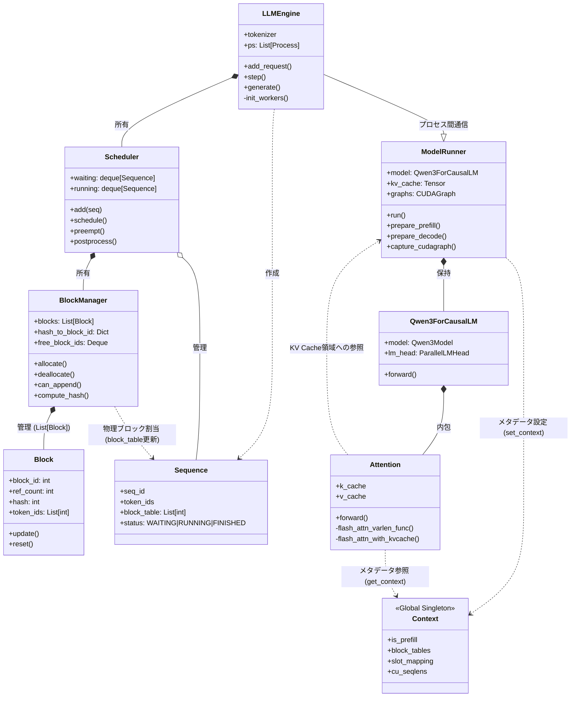
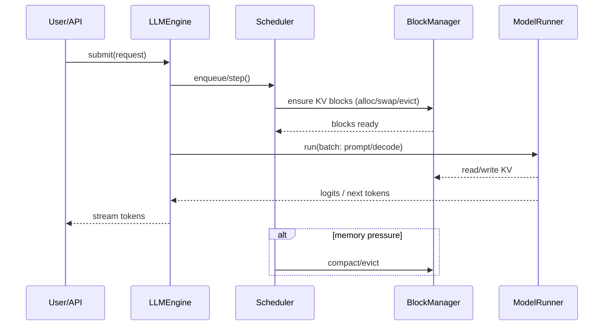
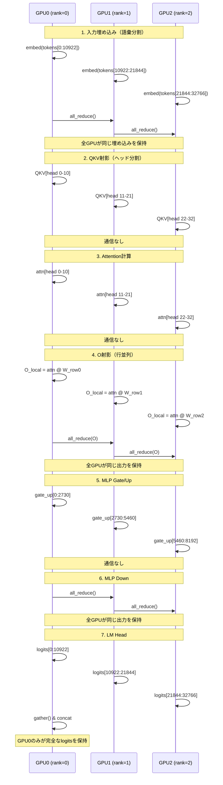

# 添付

## 構成図

```mermaid
classDiagram
    %% メインの制御フロー
    class LLMEngine {
        +tokenizer
        +ps: List[Process]
        +add_request()
        +step()
        +generate()
        -init_workers()
    }

    class Scheduler {
        +waiting: deque[Sequence]
        +running: deque[Sequence]
        +add(seq)
        +schedule()
        +preempt()
        +postprocess()
    }

    class BlockManager {
        +blocks: List[Block]
        +hash_to_block_id: Dict
        +free_block_ids: Deque
        +allocate()
        +deallocate()
        +can_append()
        +compute_hash()
    }

    class Block {
        +block_id: int
        +ref_count: int
        +hash: int
        +token_ids: List[int]
        +update()
        +reset()
    }

    class Sequence {
        +seq_id
        +token_ids
        +block_table: List[int]
        +status: WAITING|RUNNING|FINISHED
    }

    %% ワーカープロセス（GPU側）
    class ModelRunner {
        +model: Qwen3ForCausalLM
        +kv_cache: Tensor
        +graphs: CUDAGraph
        +run()
        +prepare_prefill()
        +prepare_decode()
        +capture_cudagraph()
    }

    class Qwen3ForCausalLM {
        +model: Qwen3Model
        +lm_head: ParallelLMHead
        +forward()
    }

    class Attention {
        +k_cache
        +v_cache
        +forward()
        -flash_attn_varlen_func()
        -flash_attn_with_kvcache()
    }

    class Context {
        <<Global Singleton>>
        +is_prefill
        +block_tables
        +slot_mapping
        +cu_seqlens
    }

    %% 関係性の定義
    LLMEngine *-- Scheduler : 所有
    LLMEngine ..> Sequence : 作成
    LLMEngine --|> ModelRunner : プロセス間通信

    
    Scheduler *-- BlockManager : 所有
    Scheduler o-- Sequence : 管理
    
    BlockManager *-- Block : 管理 (List[Block])
    BlockManager ..> Sequence : 物理ブロック割当 (block_table更新)

    ModelRunner *-- Qwen3ForCausalLM : 保持
    ModelRunner ..> Context : メタデータ設定 (set_context)
    
    Qwen3ForCausalLM *-- Attention : 内包
    Attention ..> Context : メタデータ参照 (get_context)
    Attention ..> ModelRunner : KV Cache領域への参照
```

## 処理の流れ

```mermaid
sequenceDiagram
    participant U as User/API
    participant E as LLMEngine
    participant S as Scheduler
    participant B as BlockManager
    participant M as ModelRunner

    U->>E: submit(request)
    E->>S: enqueue/step()

    S->>B: ensure KV blocks (alloc/swap/evict)
    B-->>S: blocks ready

    E->>M: run(batch: prompt/decode)
    M-->>B: read/write KV
    M-->>E: logits / next tokens

    E-->>U: stream tokens
    alt memory pressure
        S->>B: compact/evict
    end
```

## モデルの並列処理

```mermaid
sequenceDiagram
    participant GPU0 as GPU0 (rank=0)
    participant GPU1 as GPU1 (rank=1)
    participant GPU2 as GPU2 (rank=2)
    
    Note over GPU0,GPU2: 1. 入力埋め込み（語彙分割）
    GPU0->>GPU0: embed(tokens[0:10922])
    GPU1->>GPU1: embed(tokens[10922:21844])
    GPU2->>GPU2: embed(tokens[21844:32766])
    GPU0->>GPU1: all_reduce()
    GPU1->>GPU2: all_reduce()
    Note over GPU0,GPU2: 全GPUが同じ埋め込みを保持

    Note over GPU0,GPU2: 2. QKV射影（ヘッド分割）
    GPU0->>GPU0: QKV[head 0-10]
    GPU1->>GPU1: QKV[head 11-21]
    GPU2->>GPU2: QKV[head 22-32]
    Note over GPU0,GPU2: 通信なし

    Note over GPU0,GPU2: 3. Attention計算
    GPU0->>GPU0: attn[head 0-10]
    GPU1->>GPU1: attn[head 11-21]
    GPU2->>GPU2: attn[head 22-32]
    Note over GPU0,GPU2: 通信なし

    Note over GPU0,GPU2: 4. O射影（行並列）
    GPU0->>GPU0: O_local = attn @ W_row0
    GPU1->>GPU1: O_local = attn @ W_row1
    GPU2->>GPU2: O_local = attn @ W_row2
    GPU0->>GPU1: all_reduce(O)
    GPU1->>GPU2: all_reduce(O)
    Note over GPU0,GPU2: 全GPUが同じ出力を保持

    Note over GPU0,GPU2: 5. MLP Gate/Up
    GPU0->>GPU0: gate_up[0:2730]
    GPU1->>GPU1: gate_up[2730:5460]
    GPU2->>GPU2: gate_up[5460:8192]
    Note over GPU0,GPU2: 通信なし

    Note over GPU0,GPU2: 6. MLP Down
    GPU0->>GPU1: all_reduce()
    GPU1->>GPU2: all_reduce()
    Note over GPU0,GPU2: 全GPUが同じ出力を保持

    Note over GPU0,GPU2: 7. LM Head
    GPU0->>GPU0: logits[0:10922]
    GPU1->>GPU1: logits[10922:21844]
    GPU2->>GPU2: logits[21844:32766]
    GPU0->>GPU0: gather() & concat
    Note over GPU0: GPU0のみが完全なlogitsを保持
```